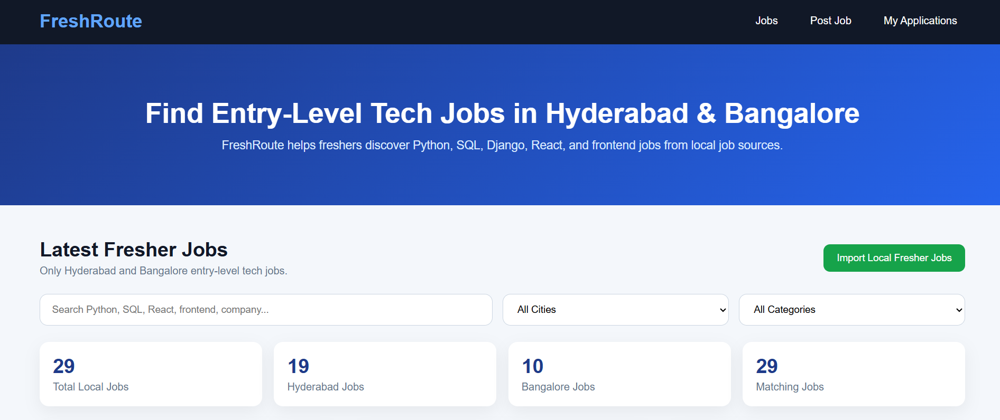
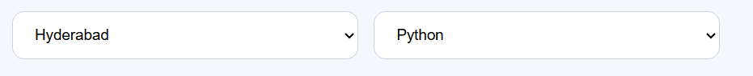
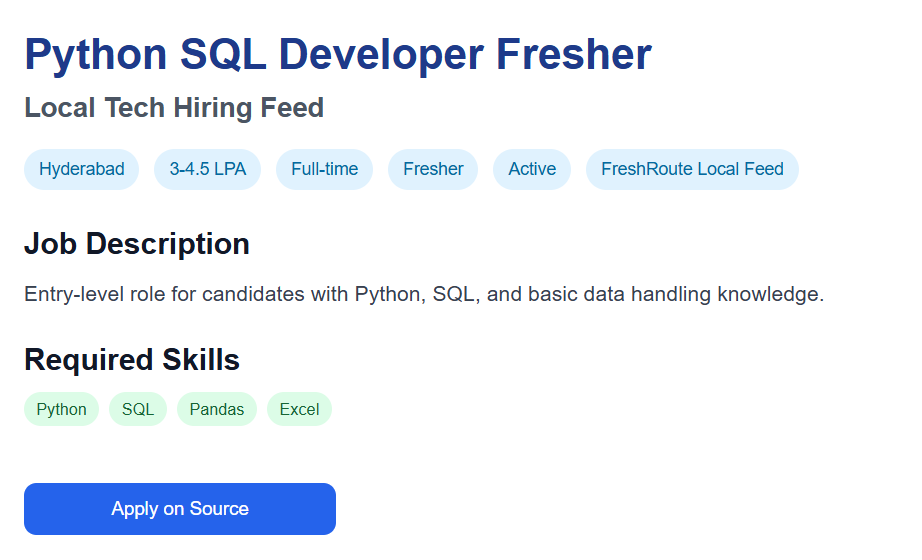
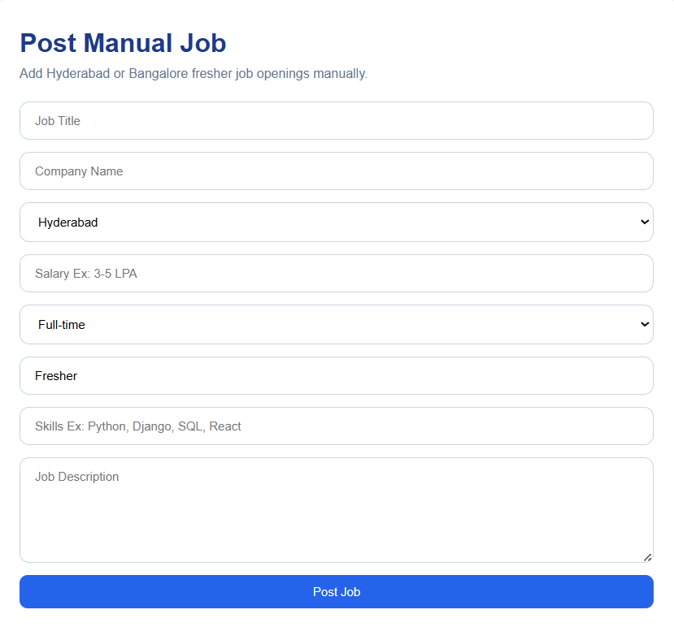
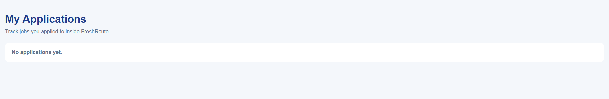
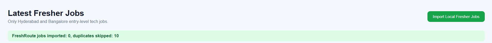
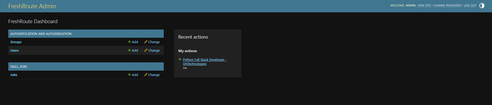
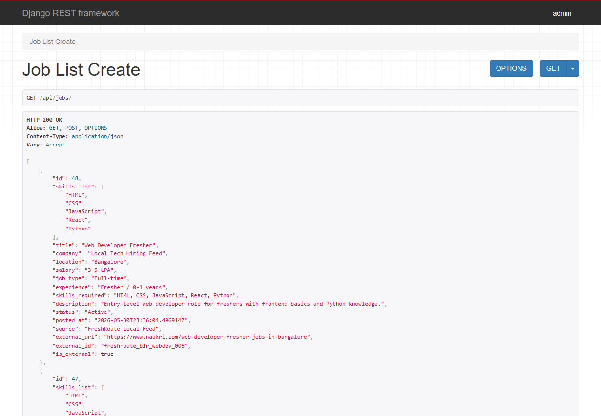

# FreshRoute - Hyderabad & Bangalore Entry-Level Tech Jobs Portal

FreshRoute is a Python full-stack job portal built for freshers looking for entry-level tech jobs in Hyderabad and Bangalore.

The platform focuses on Python, Django, SQL, React, Frontend, and full-stack fresher jobs. It supports manual job posting, local fresher job importing, city-based filtering, category filtering, job details, external apply links, and application tracking.

## Features

- Hyderabad and Bangalore fresher job listings
- Python, Django, SQL, React, and Frontend job categories
- Manual job posting for recruiters/admins
- Local fresher job importer
- Job search by title, company, or skill
- City filter for Hyderabad and Bangalore
- Category filter for Python, Django, SQL, React, and Frontend
- Job details view
- External apply links for imported jobs
- Internal application tracking using localStorage
- Django REST API backend
- React frontend

## Screenshots

### Home Page


### Job Search and Filters


### Job Details Page


### Recruiter Manual Job Posting


### My Applications


### Local Job Importer


### Django Admin Panel


### Django REST API


## Execution Flow

1. Recruiter or admin can manually post fresher jobs using the Post Job form.
2. The Local Fresher Job Importer adds Hyderabad and Bangalore entry-level jobs into the database.
3. Candidates can search jobs by title, company, or skills.
4. Candidates can filter jobs by city and category.
5. Candidates can view complete job details.
6. Imported jobs redirect users to external apply links.
7. Manual jobs support internal Apply Now flow.
8. Applied jobs are tracked in the My Applications section using localStorage.

## Tech Stack

### Frontend
- React.js
- JavaScript
- CSS
- Vite

### Backend
- Python
- Django
- Django REST Framework
- SQLite

## API Testing

The backend APIs can be tested using Django REST Framework or Postman.

### Get all jobs

```http
GET http://127.0.0.1:8000/api/jobs/